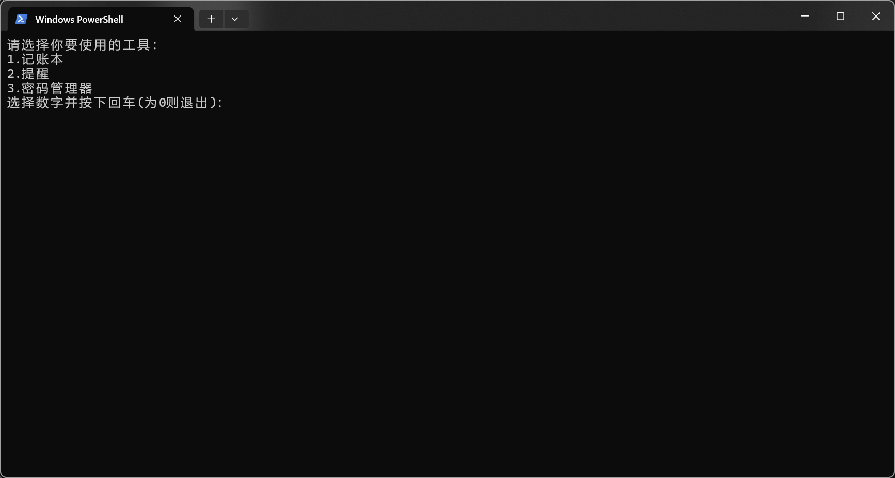
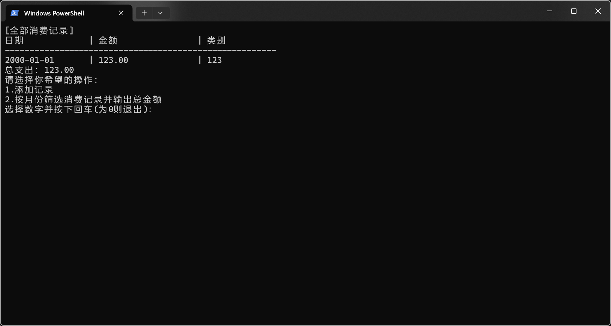
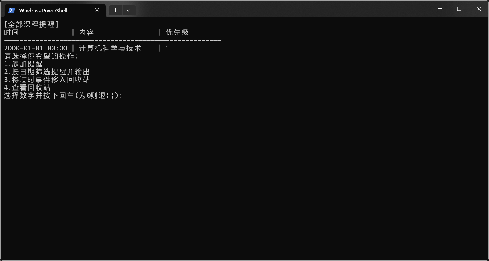
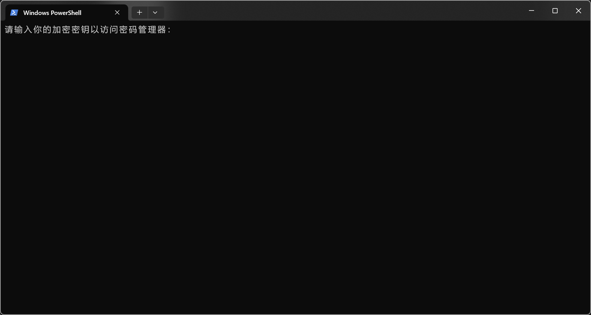
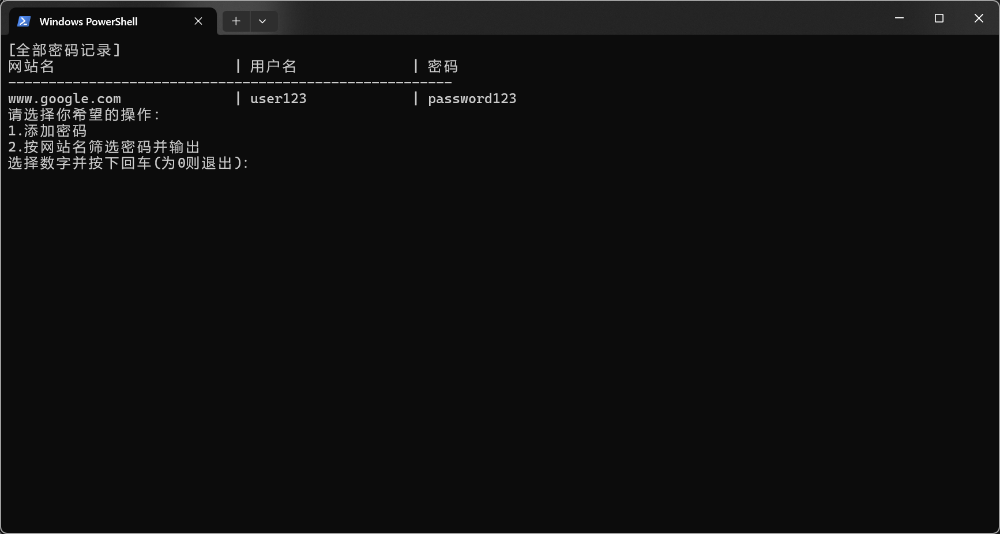
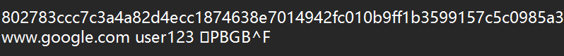

点击即可查看[大作业项目要求](https://github.com/YanniYang-PolyU/2025-Cplusplus-Project)
# 项目进展
目前项目已完成，项目地址：[Github项目地址](https://github.com/azusake/sdu-2-homework.git)

# 开发过程
## 项目构思
观察项目要求：
> 要求
> 1. 记账本模块
>     - 记录每日消费：日期（YYYY-MM-DD）、金额、类别
>     - 按月统计消费：输入月份（YYYY-MM）显示该月所有消费记录及总金额
>     - 数据保存：将记录保存到finance.txt文件
>     - 数据显示：表格化输出消费记录（对齐列宽）
> 2. 课程提醒模块
>     - 添加提醒：包含时间（YYYY-MM-DD HH:MM）、事件内容、优先级（1-3）
>     - 按日期查询：输入指定日期（YYYY-MM-DD）显示当天所有提醒事项
>     - 自动排序：按时间顺序自动排序提醒事项
>     - 数据保存：将记录保存到reminder.txt文件
> 3. 密码管理模块
>     - 存储密码：记录网站名称、用户名、密码（加密存储）
>     - 密码查询：支持网站名称大小写不敏感搜索，显示密码明文
>     - 数据保存：将记录保存到password.txt文件
> 4. 文件操作
>     - 添加记录时自动将记录存在相应的文件当中（如记账信息存到finance.txt中，课程提醒存到reminder.txt中，密码存在password.txt中）
>     - 当启动系统时，自动加载所有文件中的记录 PS: 我传了一个我写的系统和测试文件，不一定是最完美的，仅供大家理解以上功能。

除了原有的要求之外，决定添加以下新功能
### 记账本
- 对消费记录按日期排序
### 课程提醒
- 加入回收站，过时的事项可以在加入回收站并在回收站中查看
### 密码管理器
- 加入密码加密凭证，无法通过程序硬编码破解
- 校验用户凭证时，使用`SHA256`算法加密凭证，增加撞库难度
- 网站搜索时，支持模糊搜索
### 文件操作
- 关闭时再次存储文件
- 自动初始化文件
- 添加日志系统
> 图形化与命令行功能基本一致

考虑到要求，决定先写一个虚基类`notebasic`，先声明三种不同模块共有的成员和功能

```C++
class notebasic {  
public:  
	// 从文件中加载数据的函数，没有参数，其加载的文件路径由类中的filepath决定
	// 在运行时，函数将会读取文件路径中的数据，数据格式为一行三个数据，由空格隔开，分别载入到三个变量，并将其这三个变量作为一个数据结构利用.push_back函数放进vector的末尾
    virtual void load_from_file() = 0;  
    // 从文件中写入数据的函数，除去数据的流向相反，其余同上
    virtual void save_to_file() = 0;  
    // 搜索函数，一般由display传入参数
    virtual void search(const string &) = 0;  
    // 排序函数，对数据按照一定规则进行排序，不同模块略有不同
    virtual void sort() = 0;  
    // 我也不知道自己为什么要写这个函数，可能本来打算前期调试
    //virtual string get_type() const = 0;  
    /* 以上为逻辑实现 */
    //--------------------------------------------------------
    /* 以下为交互实现 */
    // 命令行的显示函数，参数为搜索函数需要的搜索值，如果输入为空字符串，就显示所有记录，搜索格式为"YYYY-MM"
    virtual void display(const string &) = 0;  
    // 命令行的初始化函数，无参数，将会清屏并输出选择，这个过程循环执行直到推出
    virtual void init() = 0;  
    // 命令行的关闭函数
    virtual void close() = 0;
    //析构函数  
    virtual ~notebasic() = default;  
};  
//考虑进一步将相似逻辑抽象出来，在基类直接写出来
```

然后是三个模块的具体实现，几乎没什么不同，可以以记账本的实现作为蓝本，稍作修改即可得到时间提醒和密码管理器
相较于记账本，提醒多了回收站，所以多了一个向量用于存储过时的记录，并修改display函数和搜索函数，使得当搜索项字符串前添加`-`前缀时，是在旧记录里搜索
密码管理器则改动更少，只在显示时加入解码器，添加记录时加入编码器，并加入用户验证界面

## 开发过程中遇到的问题
1. 命令行交互时，由于Windows控制台默认使用GBK编码，而程序使用UTF-8编码，导致输出出现乱码，**解决办法**：针对windows系统，利用`WIN`宏设置编码为UTF-8
2. 交互上，由于要做多系统兼容，发现不同系统的清屏和隐私输入使用的命令不同，需要利用宏区分系统

# 最终的效果
## 总界面

## 记账本

## 日程提醒

## 密码管理器的用户凭证校验

## 密码管理器

## 密码管理器的加密存储

下一章，图形化实现